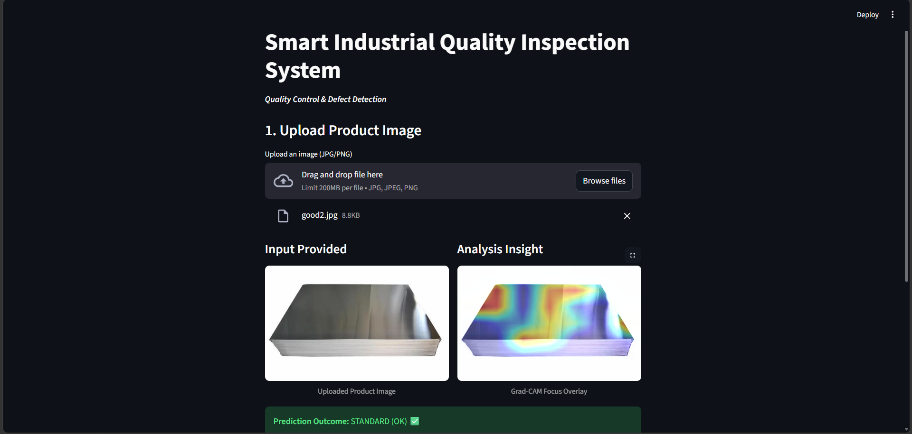
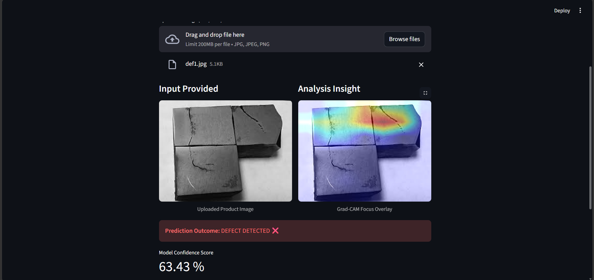

# 🏭 AI-Powered Automated Defect Detection in Industrial Products  

  
  
  
  
   
  <strong><a href="https://defect-detection-computer-vision.streamlit.app/" target="_blank">View Live</a></strong>

 

---

This project is an end-to-end Computer Vision-based Defect Detection System designed for industrial quality inspection.  
It uses Transfer Learning (MobileNetV2) to classify industrial product images as:

- OK (Non-Defective)
- Defective

The system is deployed using Streamlit Cloud for real-time image prediction.

---

## Objective

To automate industrial quality inspection using AI and reduce manual inspection errors by detecting surface defects in real time.

---

### Prediction Result-01

---

## Key Features

- Real-time defect detection from uploaded images  
- Deep Learning model using MobileNetV2 (Transfer Learning)  
- Model evaluation using Accuracy, Precision, Recall, and F1-score  
- Interactive web UI using Streamlit  
- Deployed on Streamlit Cloud  
- Optional explainability using Grad-CAM  

---

### Prediction Result-02

---

## Tech Stack

- Python  
- TensorFlow / Keras  
- OpenCV  
- NumPy  
- Scikit-learn  
- Streamlit  

---

## How It Works

1. Upload an image of an industrial product  
2. Image is preprocessed (resize and normalization)  
3. CNN model predicts defective or non-defective  
4. Result is displayed with confidence score  

---

## Model Architecture

- Base Model: MobileNetV2 (Pretrained on ImageNet)  
- Type: Transfer Learning  
- Output: Binary Classification (Defective / OK)  

---

## Evaluation Metrics

- Accuracy  
- Precision  
- Recall  
- F1-Score  

